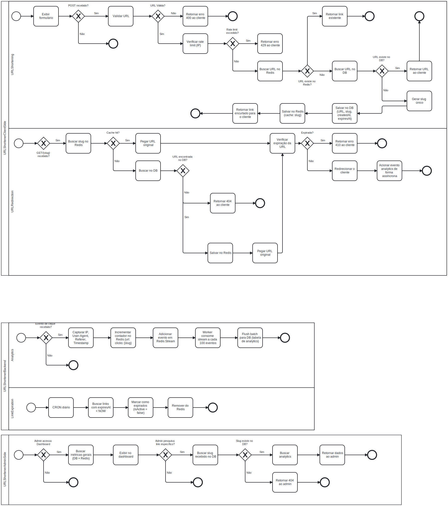

# URL Shortener

## Business Process Model and Notation diagram


## Arquitetura
! [HexagonalArchitecture](./HexagonalArchitecture)

## Tecnologias
- Java 21
- Spring Boot 3.5.13
- PostgreSQL 16
- Docker + Kubernetes
- Redis 7
- Spring Data JPA
- Nginx
- Terraform
- ArgoCD
- Github Actions
- Prometheus
- Grafana
- Loki
- Spring Boot Actuator
- JUnit 5 + Mockito
- JaCoCo
- SonarQube

## Conceitos Aplicados
✅ TDD (cobertura: 92%)

✅ Arquitetura Hexagonal

✅ SOLID Principles

✅ REST API (OpenAPI spec)

✅ CI/CD (GitHub Actions)

✅ Clean Code

## Como Rodar
```bash
docker-compose up
```

## Endpoints
to do: add links swagger

## Testes
```bash
./mvnw test
```

## Métricas
to-do